Processing microtome slides with GIMP and ImageJ
================
Roman M. Link

# Introduction

This is a simplified short form of the BOT2
[tutorial](https://github.com/r-link/microtome_slides) for the
pre-processing and analysis of wood anatomical microtome slides based on
[GIMP](https://www.gimp.org/) and [ImageJ](https://imagej.nih.gov/ij/)
which is meant for in-class use.

A list of useful GIMP shortcuts can be found here:
(<https://www.gimpusers.com/gimp/hotkeys>).

Note that the term `CODE` in this document is a placeholder that has to
be replaced by the unique ID of sample you are working with\! In the
screenshots in this example, the `CODE` is `CRI_3_010`.

# Important note

All ImageJ results tables can be saved either in ‘Comma Separated Value’
(`.csv`) or whitespace/tabstop separated format (generated when saving
with a `.xls` extension, but actually just a plain text format). In
either case, the output is optimized for US/UK locales, which means that
points are used as a decimal separator. In order to process these files
on German systems without compatibility issues, it is important to make
sure that the system-wide decimal separator is correctly set before
starting the analysis.

In German Windows 10, the option to change the decimal separator is well
hidden:

**Start Menu ➜ Windows-System ➜ Systemsteuerung ➜ Zeit und Region ➜
Region ➜ Formate ➜ Weitere Einstellungen ➜ Dezimaltrennzeichen**

To avoid data compatibility problems, make sure the decimal separator is
set to “.”. In this case, you will want the grouping symbol (**Symbol
für Zifferngruppierung**) to be a comma instead of the point symbol
used in Germany.

If you do not want to change your system settings, you can alternatively
export everything in a `.csv` format and use Excel’s **Daten ➜ Text in
Spalten** menu to manually set field delimitor and decimal separator.

# Preparation in GIMP

1.  Open original image `CODE.jpg`

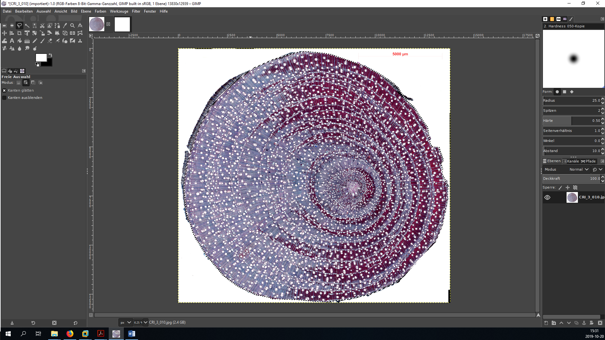

2.  Cut out a wedge of the original image with the Polygon Lasso tool
    (GIMP shortcut: *F*)
      - Select a wedge of the original picture
          - select a representative section of the sample (i.e., avoid
            tension and compression wood),
          - trace the ray parenchyma to avoid including incomplete
            vessels,
          - a subsample of around 300-500 vessels is sufficient, but
            1000+ is preferable.
      - In older versions of GIMP, a double click ends the selection
        process. In the current version, you have to press *Enter*
        instead.
      - Copy selection (*Ctrl + C*),
      - Paste selection to new file (*Ctrl + Shift + V*). Use the
        shortcut instead of creating a new file manually - this way the
        image will be automatically cropped, which saves computing
        power.

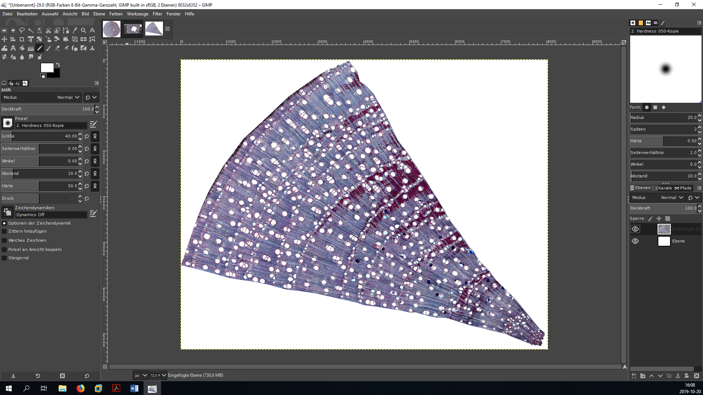

3.  Save the file `CODE_GI_cropped_01.jpg` (using the “Export as” option
    or via *Ctrl + Shift + E*).

4.  Close tab with original image (do *not* save changes\!)

5.  \[optionally\] adjust brightness and contrast using color curves
    (German: **Farben ➜ Kurven**, English: **Colors ➜ Curves**)
    
      - move the lower point close to the left end of the histogram to
        make sure the darkest portions of the image are actually black.

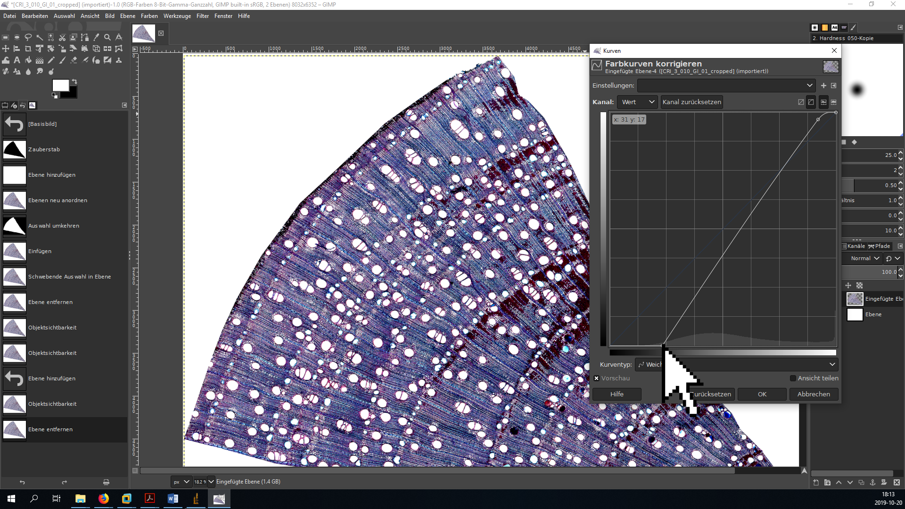

6.  If your sample is surrounded by transparency (indicated by a
    checkerboard pattern) instead of a white background:
      - make sure the background color is set to white (Press *D* to
        switch to the standard foreground/background colors),
      - right click on the layer and remove the alpha channel
        (**Alphakanal entfernen**),
      - now the image should be surrounded by a white background.
7.  Decompose the image into its RGB components (German: **Farben ➜
    Komponenten ➜ Zerlegen**, English: **Colors ➜ Components ➜
    Decompose**) - this creates a new image that separates the original
    image into its red, green and blue channel (if this step changes the
    shape of the wood section and suddenly cut-out areas reappear, you
    forgot to delete the alpha channel).

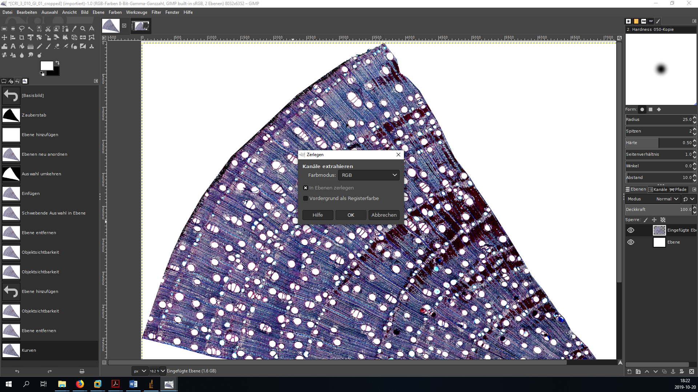

8.  Hide all layers except the green layer by clicking on the eye symbol
    in the *Layers* panel, then export (*Ctrl + Shift + E*) the new
    image as `CODE_GI_cropped_02.jpg`.

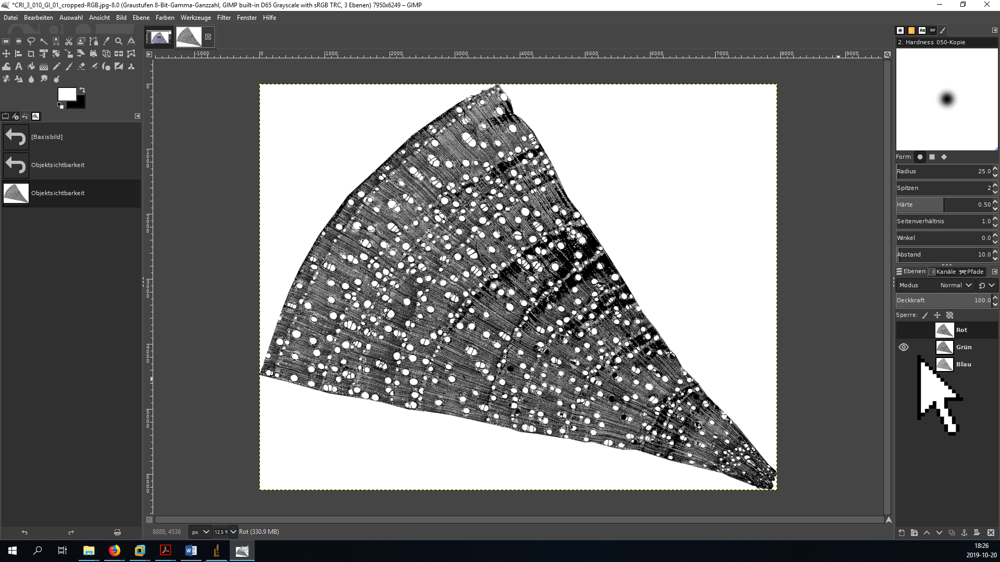

9.  Close the tab with the black and white image.

# Analysis in ImageJ

10. open ImageJ.
      - **IMPORTANT:** make sure that the options for analyzing
        threshold images are correctly set. Go to **Process ➜ Binary ➜
        Options** and make sure that the box **Black background** is not
        marked to avoid problems with the particle analysis macro.

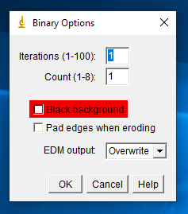

11. open the original image with the scale bar
    (`CODE.jpg`) with ImageJ (either by the File dialog or by dragging
    and dropping onto the ImageJ window).
      - Make sure the image is set to grayscale (i.e. 8bit color space)
        by verifying if \_\_Image ➜ Type ➜ 8bit \_ is selected.
12. zoom in (*Strg + mouse wheel*) and move the image with the hand tool
    (or by holding & clicking while pressing the space bar) until the
    scale bar fills the entire screen.
13. use the **Straight Line** tool to draw a line from one end of the
    scale bar to the other.
      - it can be helpful to first roughly position it and then zoom in
        more. The endpoints of the **Straight Line** can be repositioned
        by holding and clicking, but be careful because the zoom
        function is buggy.

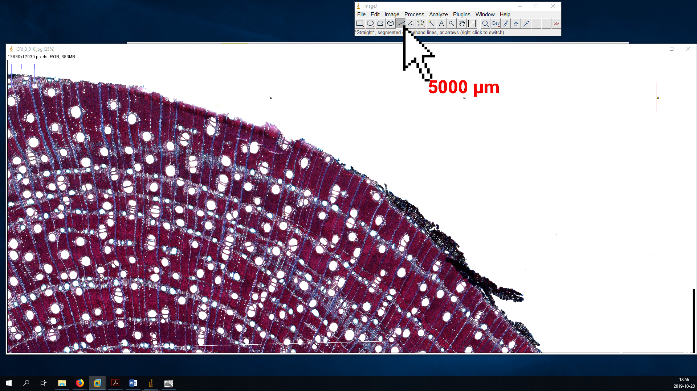

14. Set the scale to the appropriate value by going to the **Analyze ➜
    Set Scale** menu.

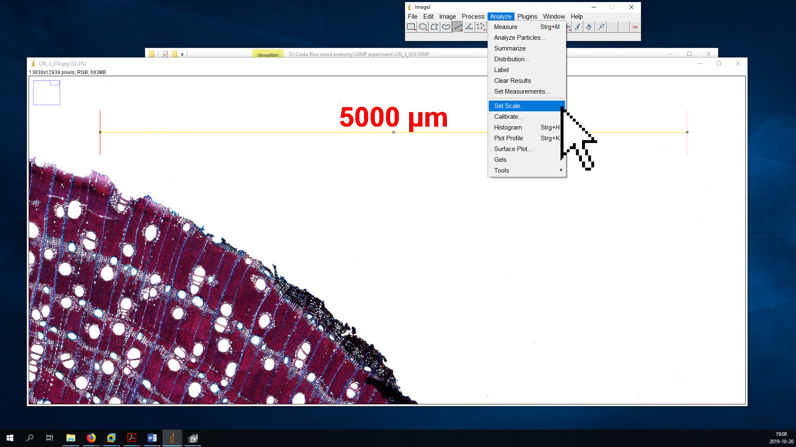

15. In the corresponding dialog, set the **Known Distance** (the value
    above the scale bar), the **Unit of length** (normally µm; see scale
    bar) and - *very important* - mark the box **Global** to make sure
    that the scale is the same accross all opened documents.

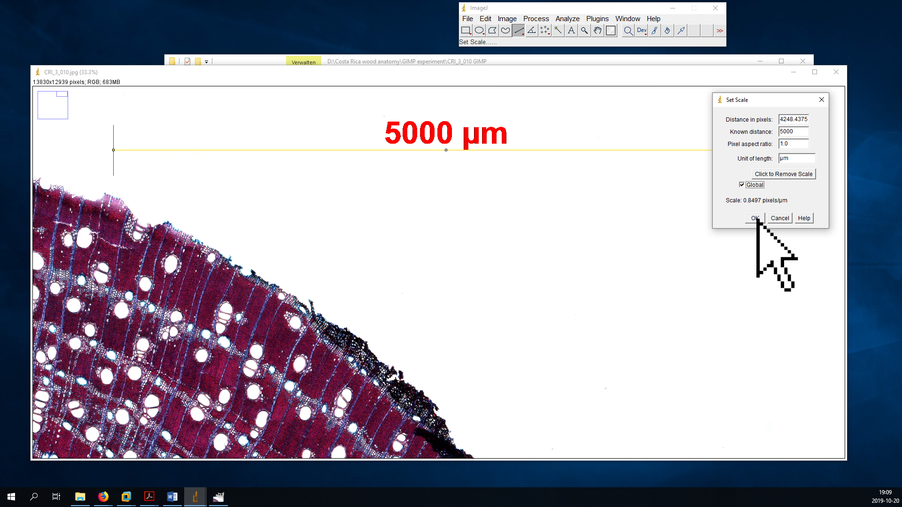

16. Open the modified image `CODE_GI_cropped_02.jpg` with ImageJ (drag &
    drop onto ImageJ bar) - if the scale is correctly set, the
    dimensions of the picture in µm should be visible in the upper left
    corner (if the values is in pixels).
17. Transform the grayscale image into a threshold image
      - zoom in until individual vessel lumina are visible,
      - Open the **Threshold** dialog (**Image ➜ Adjust ➜ Threshold** or
        *Ctrl + Shift + T*),
      - Choose the options **Default** and **B\&W** and mark the box
        **Dark background**,
      - Move the upper slider to find a threshold value that properly
        separates vessel lumina from background tissue without
        shrinking/increasing their size, and with minimal occurrence of
        “fuzzy edges” (mostly ca. 100-130),
      - press **Apply** and close the **Threshold** window.

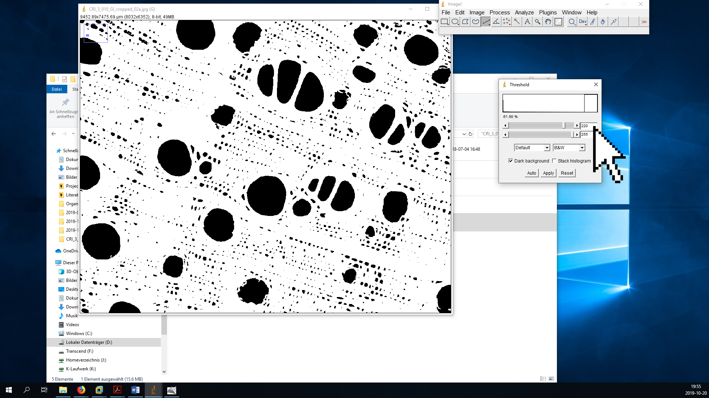

18. Save this image as `CODE_GI_cropped_02_TH_01.jpg`
      - do NOT use the Save/Save As shortcut, because it will
        automatically save in `.tiff` format
      - instead, use the **File ➜ Save As ➜ Jpeg** dialog

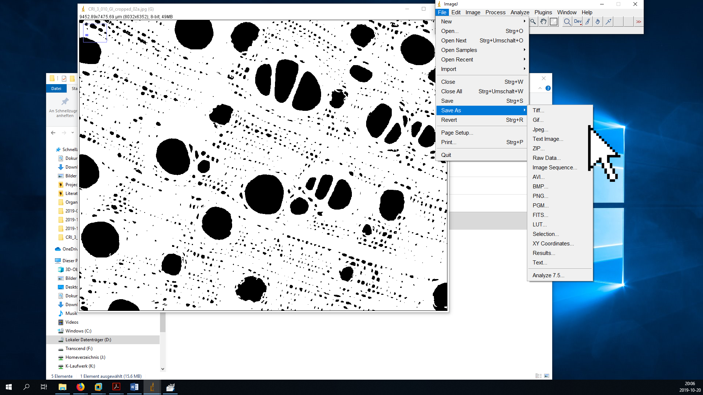

19. zoom out and measure the area of the sample
      - use the **Wand** tool to click into the black area around the
        sample - a portion of the black area will now be selected
        (highlighted by a barely visible yellow outline) \[there are
        some bugs with the **Wand** tool. If it does not select
        anything, it sometimes helps if you click into different areas
        of the image. The lower left seems to work best (don’t even
        ask…)\].
      - measure the size of the selected area using *Ctrl + M* (or
        **Analyze ➜ Measure**),
      - if the surrounding area is separated in several portions, repeat
        the previous steps for all of them,
      - finally, press *Ctrl + A* to select the entire image and measure
        with *Ctrl + M*,

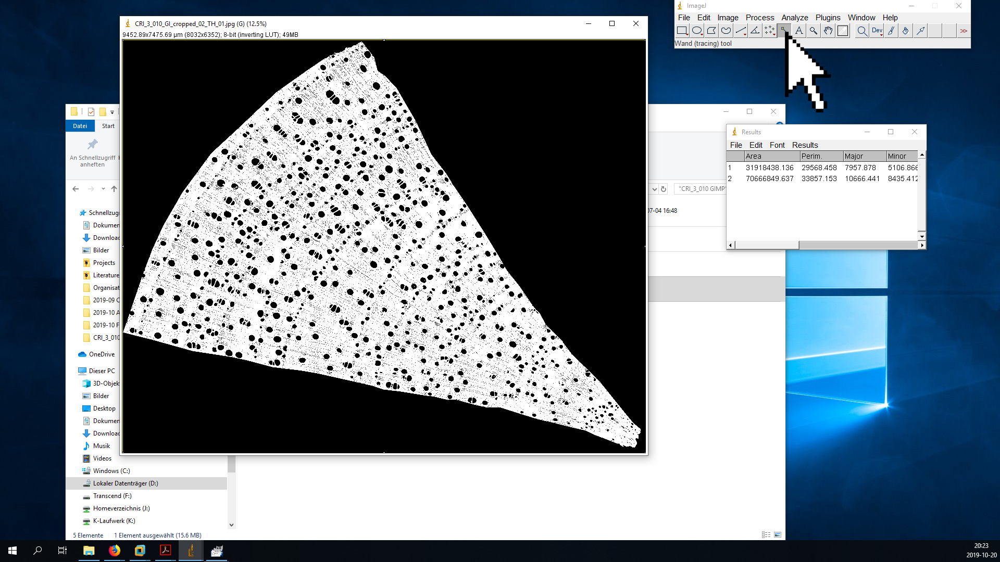

20. open the saving dialog by clicking File ➜ Save As in the **Results**
    window and save as `CODE_GI_cropped_02_TH_01_Area.xls`. The area of
    the analyzed wood portion can then be calculated by substracting the
    black area from the total area of the image.

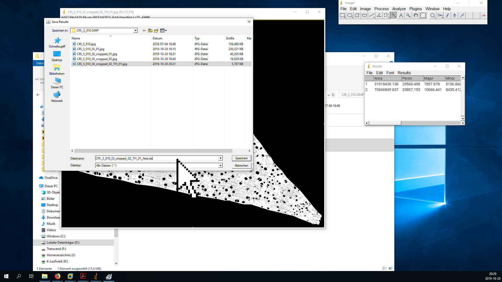

21. Use the **Flood Fill** tool to replace the surrounding black area
    with a solid white color.

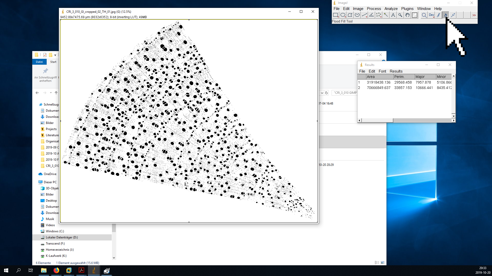

22. Save the image without the black area as
    `CODE_GI_cropped_02_TH_02.jpg`

23. To prepare for automated vessel detection, open the **Analyze ➜ Set
    Measurements** dialog and select **Area**, **Shape descriptors**,
    **Perimeter**, **Fit ellipse** and **Feret’s diameter**

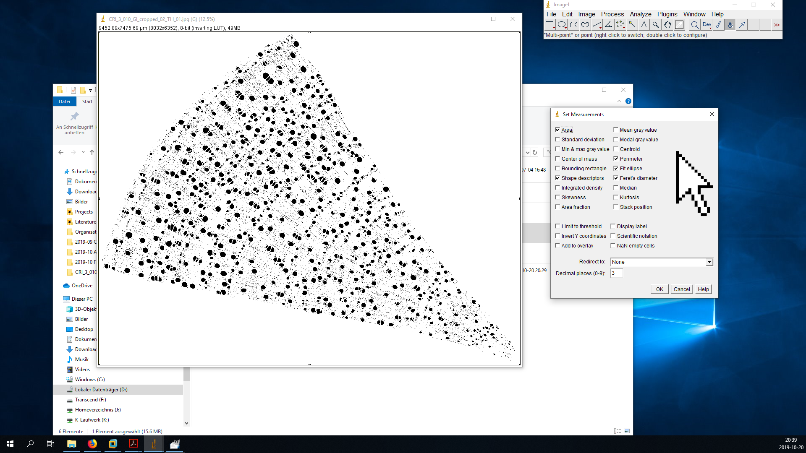

24. Open the **Analyze ➜ Analyze Particles**
    dialog,

<!-- end list -->

  - Choose reasonable values for **Size** and **Circularity**:
      - **Size** (µm²): permitted range of vessel areas in µm². The
        minimum is normally more important because it helps to exclude
        tracheids. For temperate species, a minimum of 100-300 is
        normally reasonable (less for conifers). The maximum can usually
        be left at *Infinity*.
      - **Circularity**: The roundness of the vessels (from 0: *not
        round at all* to 1: *perfect circles*). This can be helpful to
        exclude brick-shaped parenchyma cells if they are in the same
        size range as vessels, but may also lead to an exclusion of
        damaged vessels. Values of 0.3/0.4-1.0 are usually reasonable.

<!-- end list -->

25. before clicking **OK**, make sure to select **Show: Outlines**, and
    mark **Display Results**, **Clear Results** and **Include Holes**.

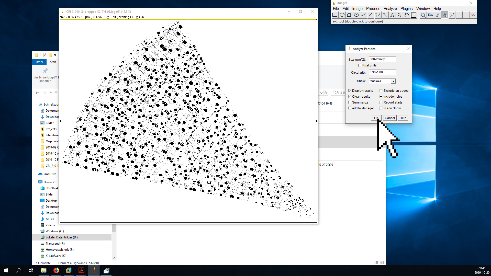

26. Save the resulting outlines as a `.jpg` document, specifying the
    selected **Area** and **Circularity** values in the name
    (e.g. `CODE_GI_cropped_02_TH_02_Outlines_300,0.3.jpg`) using the
    **File ➜ Save As ➜ Jpeg** option in the main menu of ImageJ (not the
    newly opened **Results** window\!). Make sure the right image window
    is selected when saving.

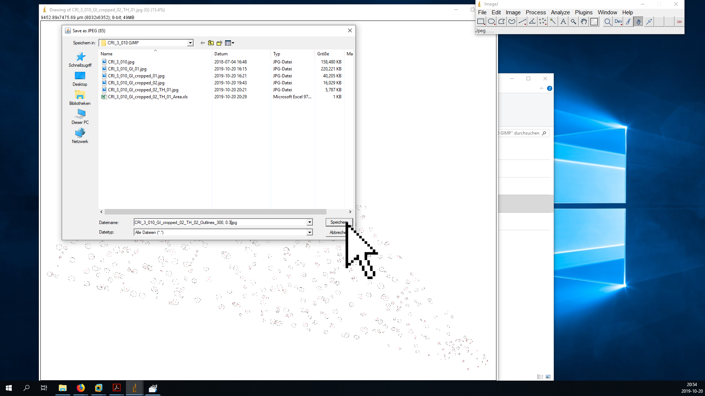

27. **Do not close** ImageJ, or you will have to [set the
    scale](#setscale) again\!

# Error inspection in GIMP

*the simplified workflow in the next couple of screenshots was
documented on a computer running Ubuntu Mate and a different version of
GIMP, but should work just the same on Windows*

28. Open the threshold file
    (`CODE_GI_cropped_02_TH_02.jpg`) and the outline
    file(`CODE_GI_cropped_02_TH_02_Outlines_300,0.3.jpg`) in GIMP (mark
    both files, right click and select Open with GIMP / Öffnen mit
    GIMP).
29. Go to the tab with the outline file, mark everything (*STRG + A*),
    copy (*STRG + C*), select the tab with the threshold image and paste
    the outlines on top of the threshold image (*STRG + V*).

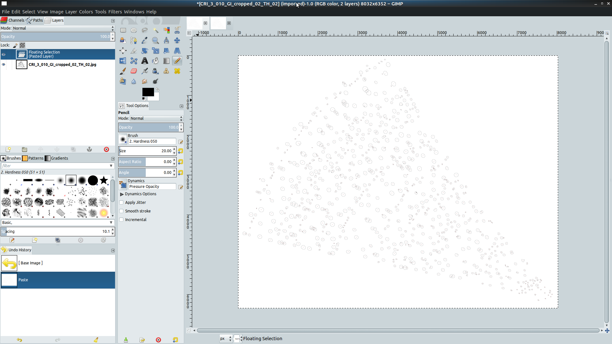

30. Right click on the new layer (which should be displayed as a
    floating selection by now) and select **New Layer ** / **Neue
    Ebene**.

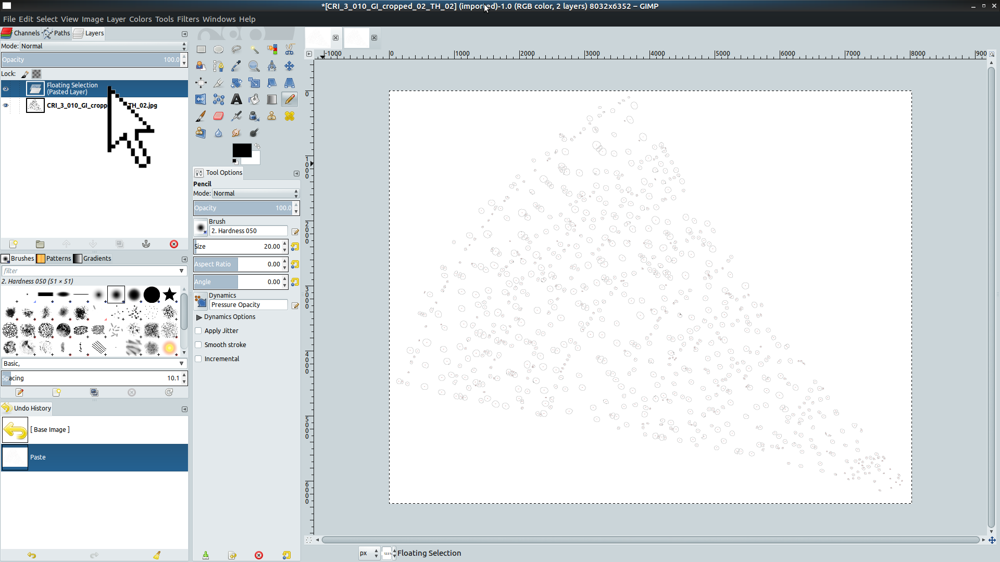

31. Choose the *Wand* tool (click in image area and press *U*) and click
    into the white area surrounding the outlines.

32. Cut out the white background with *STRG + X*.
33. Now the threshold image and the classification are overlaid, and it
    should be possible to identify places where the classification did
    not work.
34. Most common problems:
      - Large vessels not recognized because of their shape - solution:
        manual correction (see below) or lower minimum on Roundness in
        ImageJ’s *Analyze Particles* tool,
      - Tracheids mistakenly classified as vessels - solution: higher
        minimum Size or higher minimum Roundness (if tracheids have a
        more blocky shape) in *Analyze Particles*.

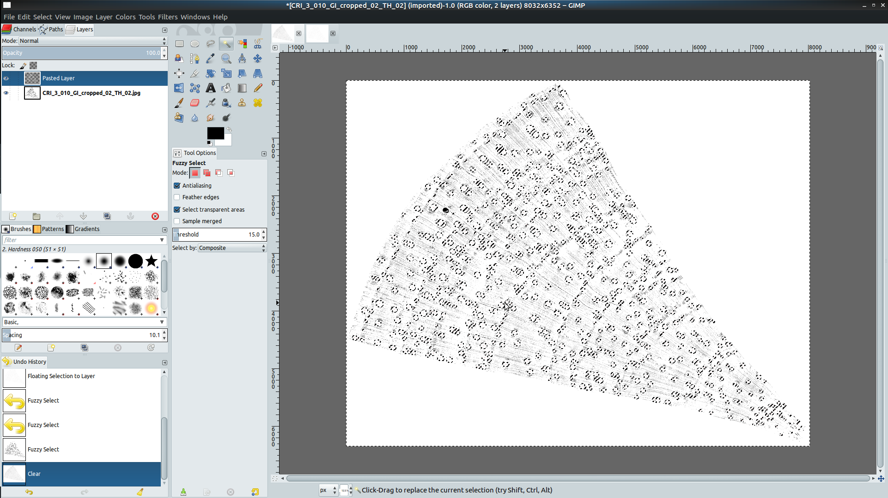

35. If there is a large number of misclassifications, go back to ImageJ
    and repeat the [*Analyze Particles*](#anpart) step with different
    settings for Roundness and Size.
36. If there are only a few misclassified vessels: manually correct
    misclassifications of large vessels.
37. Make sure you choose to edit the layer with the threshold image.
38. Choose the pencil tool (shortcut: *N*) to edit the threshold image
    and
      - make sure the right tool options are set: Hardness and Opacity
        should be at 100,
      - *Alt + up/down arrow* or *Alt Gr + mouse wheel* change the
        pencil tool tip size,
      - *X* can be used to switch between background and foreground
        color (black and white).

39. Zoom in to places where large vessels were misclassified and
    “repair” large vessels with wall damage that reduces their
    roundness below the classification level.

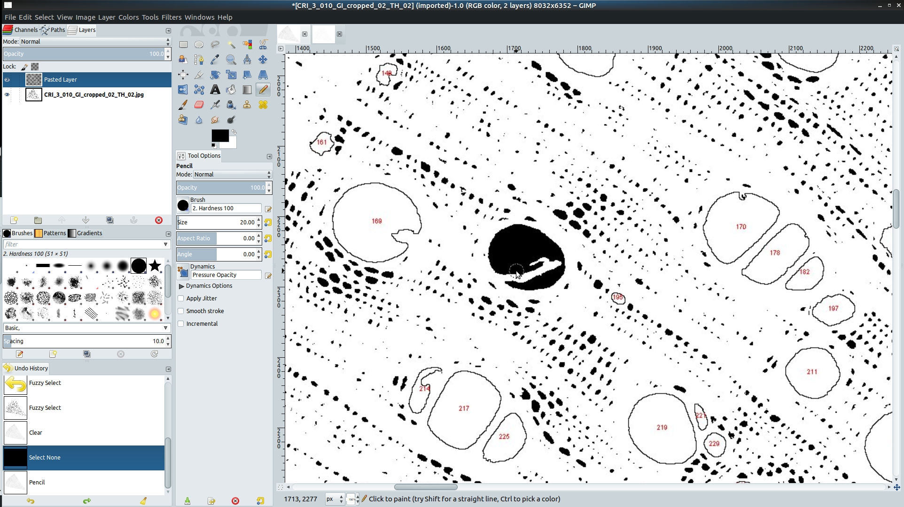

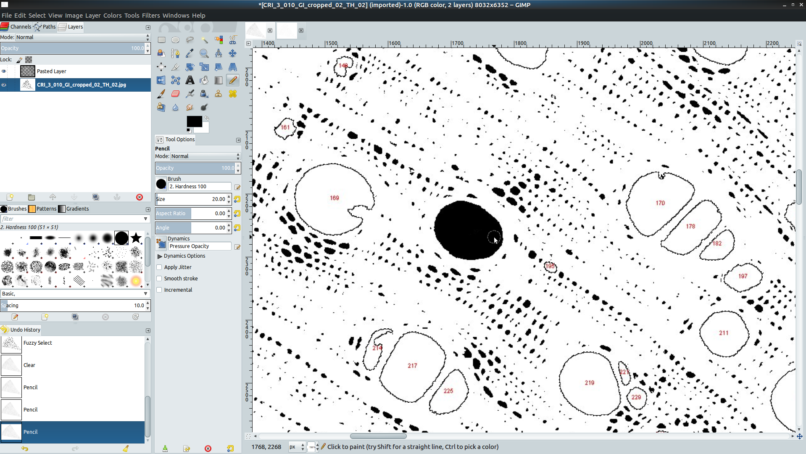

40. Use white color to remove tracheids that are erroneously classified
    as vessels,
      - click on the eye symbol on the left of the outline layer to
        show/hide them & see what you are doing (arrow\!),

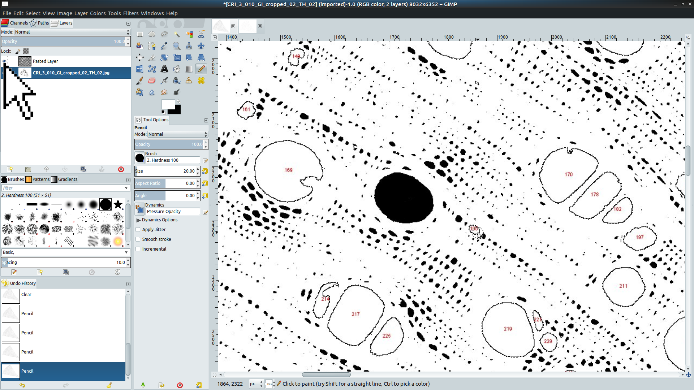

41. When you have finished editing, hide the outline layer (eye
    symbol\!) and export the threshold layer as
    `CODE_GI_cropped_02_TH_02_edit.jpg` using the “Export as” dialog or
    *Strg + Shift + E*.

# Final steps

42. Now, open the image in ImageJ (drag and drop) \[if no size in µm is
    shown on the upper left of the image window, you have to [set the
    scale](#setscale) again; see above\],
43. Click on **Image ➜ Type ➜ 8bit** to make sure resetting the
    threshold works,
44. Reset the threshold by clicking **Image ➜ Adjust ➜ Threshold**
      - The choice of the threshold value should not matter because the
        image is black and white,
      - In some cases it may be necessary to uncheck “Dark Background”
        to avoid a color swap.

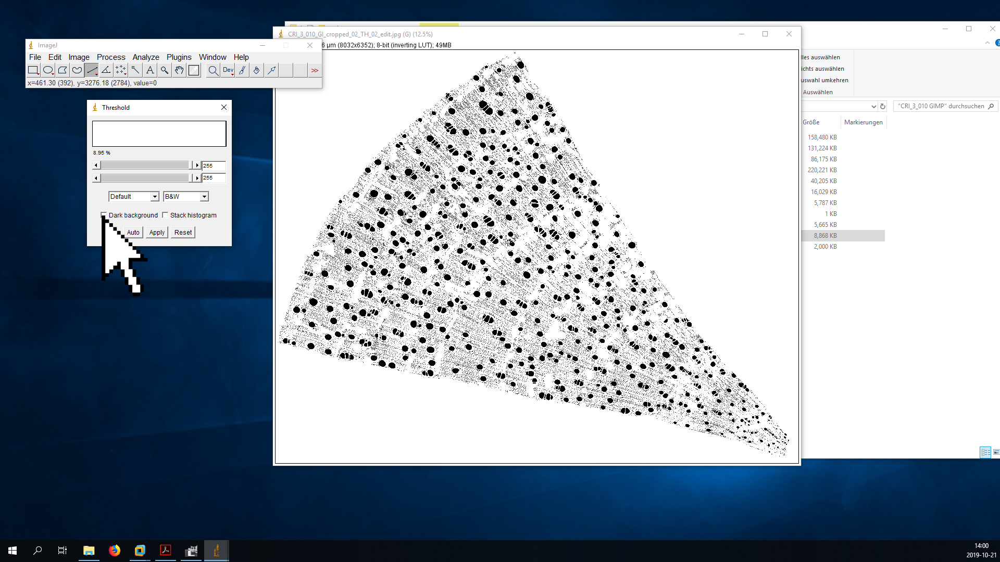

45. Repeat all steps starting from the [*Analyze Particles*](#anpart)
    section.

46. Save the new outlines as
    `CODE_GI_cropped_02_TH_02_edit_Outlines_300,0.3.jpg` (**File ➜ Save
    As** in the main window).

47. If you are happy with your classification results, save them as
    `CODE_GI_cropped_02_TH_02_edit_Outlines_300,0.3_Results.xls` (**File
    ➜ Save as** in the Results window).

48. Use GIMP to copy the new outlines on top of the threshold image and
    cut out the background ([just as in this step](#inspect)).

49. Save the resulting image (using the “Export as” dialog or \_STRG +
    Shift + E\_\_) using the name
    `CODE_GI_cropped_02_TH_02_edit_Outlines_300,0.3_Analysis.jpg`.

50. Your project folder should now look somewhat like this (note that
    often, you will have to try more than one setting for circularity
    and minimum vessels size, and you will have to do more than one
    edit, which all show up as additional files in the project folder):

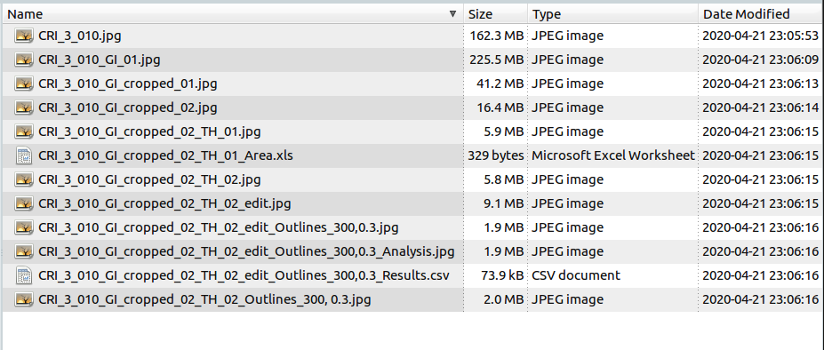
