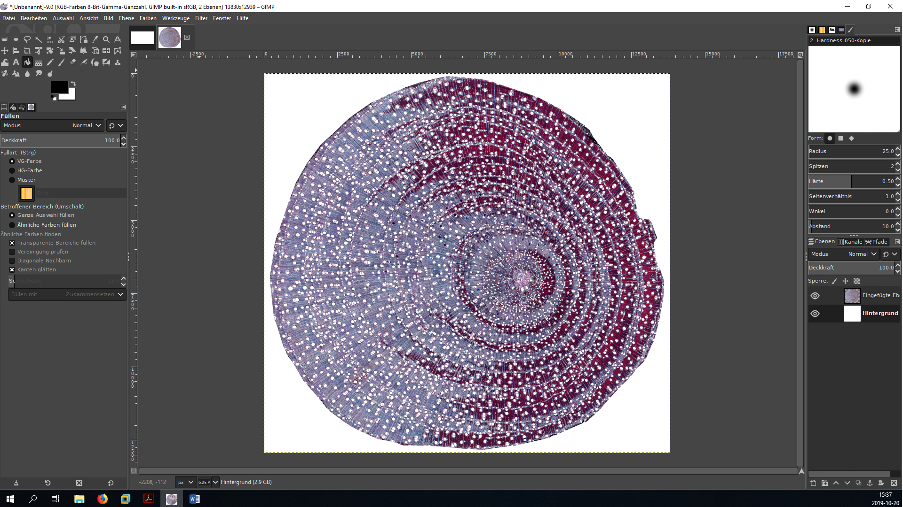
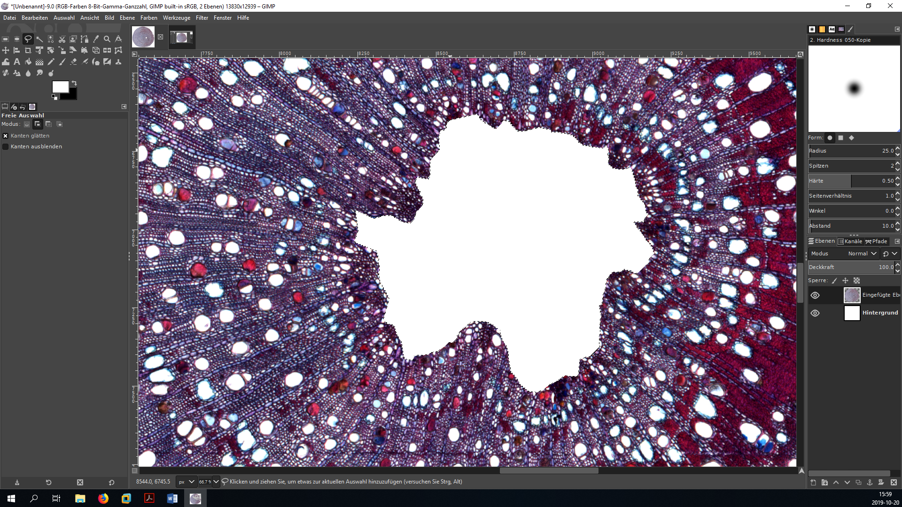

Processing microtome slides with GIMP and ImageJ
================
Roman M. Link

# Introduction

This is a simplified short form of the BOT2
[tutorial](https://github.com/r-link/microtome_slides) for the
pre-processing and analysis of wood anatomical microtome slides based on
[GIMP](https://www.gimp.org/) and [ImageJ](https://imagej.nih.gov/ij/)
which is meant for in-class use.

A list of useful GIMP shortcuts can be found here:
(<https://www.gimpusers.com/gimp/hotkeys>).

Note that the term `CODE` in this document is a placeholder that has to
be replaced by the unique ID of sample you are working with\! In the
screenshots in this example, the `CODE` is `CRI_3_010`.

# Important note

All ImageJ results tables can be saved either in ‘Comma Separated Value’
(`.csv`) or whitespace/tabstop separated format (generated when saving
with a `.xls` extension, but actually just a plain text format). In
either case, the output is optimized for US/UK locales, which means that
points are used as a decimal separator. In order to process these files
on German systems without compatibility issues, it is important to make
sure that the system-wide decimal separator is correctly set before
starting the analysis.

In German Windows 10, the option to change the decimal separator is well
hidden:

**Start Menu ➜ Windows-System ➜ Systemsteuerung ➜ Zeit und Region ➜
Region ➜ Formate ➜ Weitere Einstellungen ➜ Dezimaltrennzeichen**

To avoid data compatibility problems, make sure the decimal separator is
set to “.”. In this case, you will want the grouping symbol (**Symbol
für Zifferngruppierung**) to be a comma instead of the point symbol
used in Germany.

If you do not want to change your system settings, you can alternatively
export everything in a `.csv` format and use Excel’s **Daten ➜ Text in
Spalten** menu to manually set field delimitor and decimal separator.

# Preparation in GIMP

  - Open original image `CODE.jpg`

  - Select the Polygon Lasso tool (GIMP shortcut: *F*) and cut out xylem
    and pith (double click to finish selection process)
    

  - Copy selection (*Ctrl + C*)

  - Paste selection to new file (*Ctrl + Shift + V*)
    

  - Close tab with original image (do *not* save changes\!)
    

  - Zoom in to focus on the pith (*+/-* or *Ctrl + mouse wheel*), select
    the Polygon Lasso tool (*F*) and cut out the pith (*Ctrl + X* or
    *Del*) 

  - Export the new picture (full xylem area with cut-out bark and pith)
    as `CODE_GI_01.jpg` (export as: *Ctrl + Shift + E*) using the
    maximal quality setting - the GI in the name means the file has been
    processed in GIMP.

  - For further analysis, select a wedge of the original picture with
    the Lasso tool (*F*) and insert it to a new file (*Ctrl + Shift +
    V*). Use the shortcut instead of creating a new file manually - this
    way the image will be automatically cropped, which saves computing
    power.
      - select a representative section of the sample (i.e., avoid
        tension and compression wood),
      - trace the ray parenchyma to avoid including incomplete vessels,
      - a subsample of around 300-500 vessels is sufficient, but 1000+
        is preferable.

  - Save the file `CODE_GI_cropped_01.jpg` (export as: *Ctrl + Shift +
    E*).

  - \[optionally\] adjust brightness and contrast using color curves
    (German: **Farben ➜ Kurven**, English: **Colors ➜ Curves**)
    
      - move the lower point close to the left end of the histogram to
        make sure the darkest portions of the image are actually black.

  - If your sample is surrounded by transparency (indicated by a
    checkerboard pattern) instead of a white background:
    
      - make sure the background color is set to white (Press *D* to
        switch to the standard foreground/background colors),
      - right click on the layer and remove the alpha channel
        (**Alphakanal entfernen**),
      - now the image should be surrounded by a white background.

  - save the image in GIMP’s `.xcf` format as `CODE_GI.xcf` or
    `CODE_GI_cropped.xcf`. This file will be used later for the
    different post-processing steps necessary to improve the initial
    image classification.

  - decompose image into its RGB components (German: **Farben ➜
    Komponenten ➜ Zerlegen**, English: **Colors ➜ Components ➜
    Decompose**) - this creates a new image that separates the original
    image into its red, green and blue channel (if this step changes the
    shape of the wood section and suddenly cut-out areas reappear, you
    forgot to delete the alpha channel).

  - hide all layers except the green layer by clicking on the eye symbol
    in the *Layers* panel, then export (*Ctrl + Shift + E*) the new
    image as `CODE_GI_cropped_02.jpg`.

  - close the tab with the black and white image.

# Analysis in ImageJ

  - open ImageJ.
  - **IMPORTANT:** make sure that the options for analyzing threshold
    images are correctly set. Go to **Process ➜ Binary ➜ Options** and
    make sure that the box **Black background** is not marked to avoid
    problems with the particle analysis macro.

  - open the original image with the scale bar (`CODE.jpg`) with ImageJ
    (either by the File dialog or by dragging and dropping onto the
    ImageJ window).
  - zoom in (*Strg + mouse wheel*) and move the image with the hand tool
    (or by holding & clicking while pressing the space bar) until the
    scale bar fills the entire screen.
  - use the **Straight Line** tool to draw a line from one end of the
    scale bar to the other.
      - it can be helpful to first roughly position it and then zoom in
        more. The endpoints of the **Straight Line** can be repositioned
        by holding and clicking, but be careful because the zoom
        function is buggy.

  - Set the scale to the appropriate value by going to the **Analyze ➜
    Set Scale** menu. 

  - In the corresponding dialog, set the **Known Distance** (the value
    above the scale bar), the **Unit of length** (normally µm; see scale
    bar) and - *very important* - mark the box **Global** to make sure
    that the scale is the same accross all opened documents.
    

  - Open the modified image `CODE_GI_cropped_02.jpg` with ImageJ (drag &
    drop onto ImageJ bar) - if the scale is correctly set, the
    dimensions of the picture in µm should be visible in the upper left
    corner (if the values is in pixels).

  - Transform the grayscale image into a threshold image
    
      - zoom in until individual vessel lumina are visible,
      - Open the **Threshold** dialog (**Image ➜ Threshold** or *Ctrl +
        Shift + T*),
      - Choose the options **Default** and **B\&W** and mark the box
        **Dark background**,
      - Move the upper slider to find a threshold value that properly
        separates vessel lumina from background tissue without
        shrinking/increasing their size, and with minimal occurrence of
        “fuzzy edges” (mostly ca. 100-130),
      - press **Apply** and close the **Threshold** window.
        

  - Save this image as `CODE_GI_cropped_02_TH_01.jpg`
    
      - do NOT use the Save/Save As shortcut, because it will
        automatically save in `.tiff` format
      - instead, use the **File ➜ Save As ➜ Jpeg** dialog

  - zoom out and measure the area of the sample
      - use the **Wand** tool to click into the black area around the
        sample - a portion of the black area will now be selected
        (highlighted by a barely visible yellow outline) \[there are
        some bugs with the **Wand** tool. If it does not select
        anything, it sometimes helps if you click into different areas
        of the image. The lower left seems to work best (don’t even
        ask…)\].
      - measure the size of the selected area using *Ctrl + M* (or
        **Analyze ➜ Measure**),
      - if the surrounding area is separated in several portions, repeat
        the previous steps for all of them,
      - finally, press *Ctrl + A* to select the entire image and measure
        with *Ctrl + M*,

  - open the saving dialog by clicking File ➜ Save As in the **Results**
    window and save as `CODE_GI_cropped_02_TH_01_Area.xls`. The area of
    the analyzed wood portion can then be calculated by substracting the
    black area from the total area of the image.

  - Use the **Flood Fill** tool to replace the surrounding black area
    with a solid white color. 

  - Save the image without the black area as
    `CODE_GI_cropped_02_TH_02.jpg`

  - To prepare for automated vessel detection, open the **Analyze ➜ Set
    Measurements** dialog and select **Area**, **Shape descriptors**,
    **Perimeter**, **Fit ellipse** and **Feret’s diameter**

  - Open the **Analyze ➜ Analyze Particles** dialog,
  - Choose reasonable values for **Size** and **Circularity**:
      - **Size** (µm²): permitted range of vessel areas in µm². The
        minimum is normally more important because it helps to exclude
        tracheids. For temperate species, a minimum of 100-300 is
        normally reasonable (less for conifers). The maximum can usually
        be left at *Infinity*.
      - **Circularity**: The roundness of the vessels (from 0: *not
        round at all* to 1: *perfect circles*). This can be helpful to
        exclude brick-shaped parenchyma cells if they are in the same
        size range as vessels, but may also lead to an exclusion of
        damaged vessels. Values of 0.3/0.4-1.0 are usually reasonable.
  - before clicking **OK**, make sure to select **Show: Outlines**, and
    mark **Display Results**, **Clear Results** and **Include Holes**.

  - Save the resulting outlines as a `.jpg` document, specifying the
    selected **Area** and **Circularity** values in the name (e.g.
    `CODE_GI_cropped_02_TH_02_Outlines_300,0.3.jpg`) using the **File ➜
    Save As ➜ Jpeg** option in the main menu of ImageJ (not the newly
    opened **Results** window\!). Make sure the right image window is
    selected when saving.

# Error inspection in GIMP

  - Open the threshold file (`CODE_GI_cropped_02_TH_02.jpg`) and the
    outline file(`CODE_GI_cropped_02_TH_02_Outlines_300,0.3.jpg`) in
    GIMP (mark both files, right click and select Open with GIMP /
    Öffnen mit GIMP).

  - EDIT and make screenshots\!\!\!\!

  - copy on top of each other

  - cut out background

  - change mode to see changes

  - go back to threshold step if it looks bad

  - final slide

  - Your project folder should now look somewhat like this (note that
    often, you will have to try more than one setting for circularity
    and minimum vessels size, and you will have to do more than one
    edit, which all show up as additional files in the project folder -
    add new figure) 
