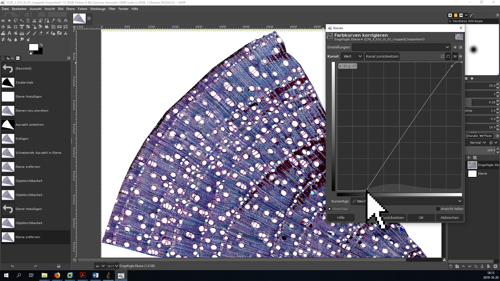
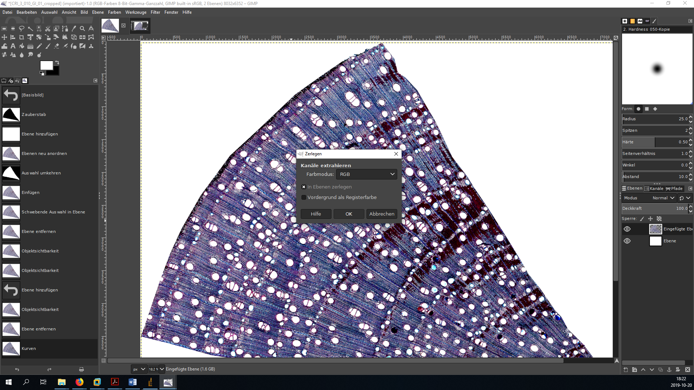
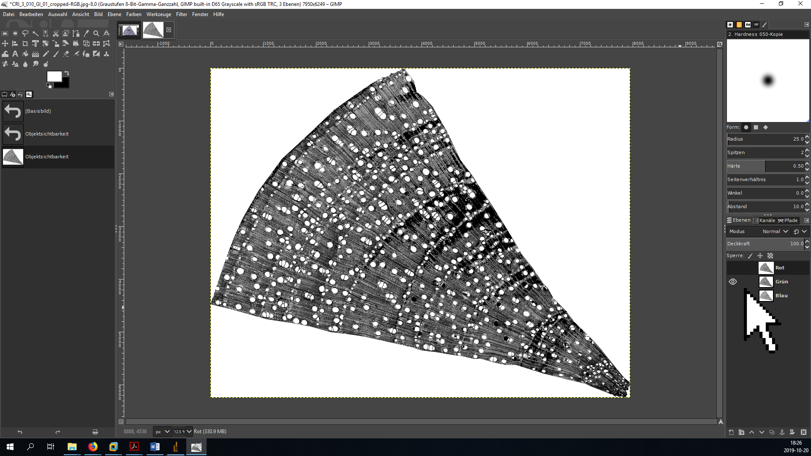
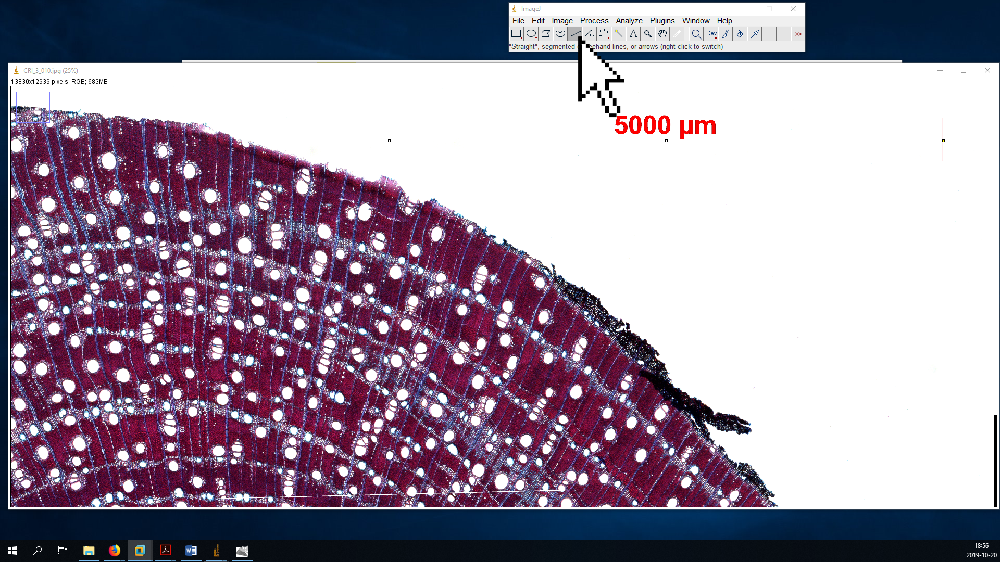
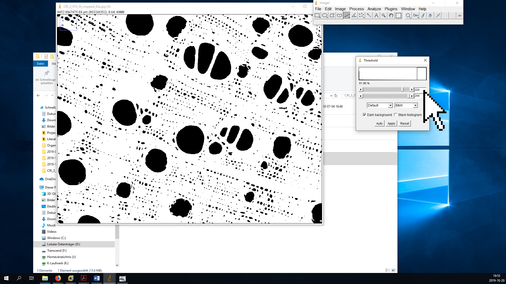
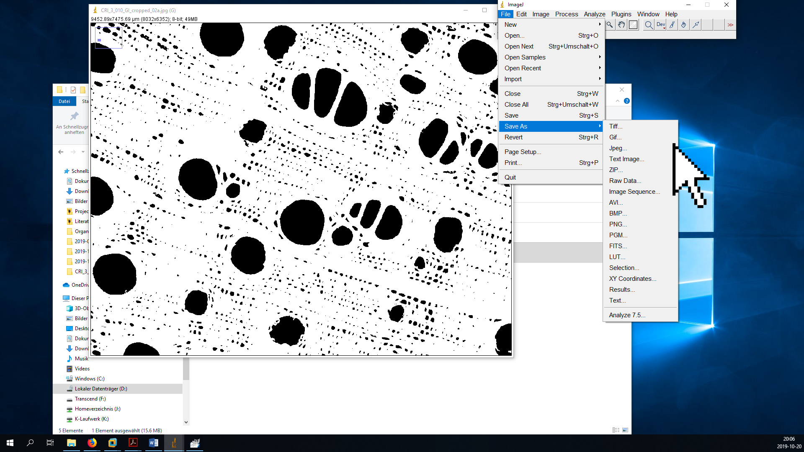
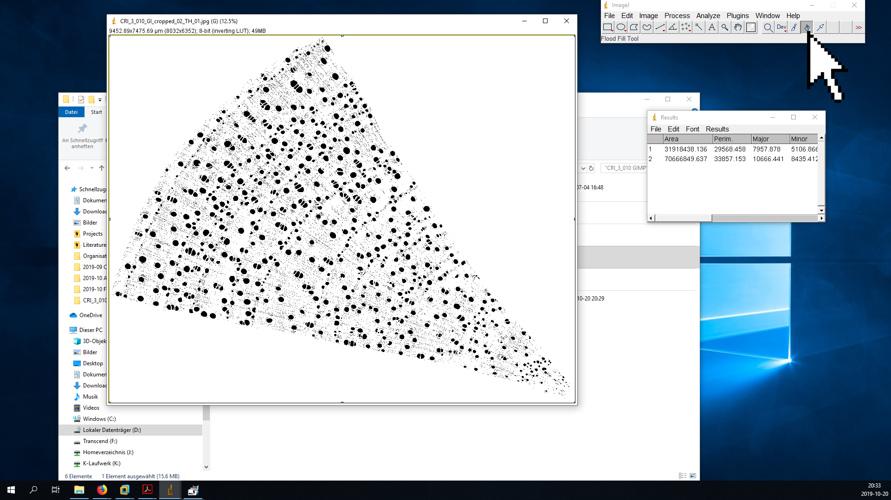

# Introduction {-} 
This is a simplified short form of the BOT2 [tutorial](https://github.com/r-link/microtome_slides) for the pre-processing and analysis of wood anatomical microtome slides based on [GIMP](https://www.gimp.org/) and [ImageJ](https://imagej.nih.gov/ij/) which is meant for in-class use. 

A list of useful GIMP shortcuts can be found here: (https://www.gimpusers.com/gimp/hotkeys).

Note that the term `CODE` in this document is a placeholder that has to be replaced by the unique ID of sample you are working with! In the screenshots in this example, the `CODE` is `CRI_3_010`.

# Important note {-}
All ImageJ results tables can be saved either in 'Comma Separated Value' (`.csv`) or whitespace/tabstop separated format (generated when saving with a `.xls` extension, but actually just a plain text format). In either case, the output is optimized for US/UK locales, which means that points are used as a decimal separator. In order to process these files on German systems without compatibility issues, it is important to make sure that the system-wide decimal separator is correctly set before starting the analysis.

In German Windows 10, the option to change the decimal separator is well hidden:

__Start Menu ➜ Windows-System ➜ Systemsteuerung ➜ Zeit und Region ➜  Region ➜ Formate ➜ Weitere Einstellungen ➜ Dezimaltrennzeichen__  

To avoid data compatibility problems, make sure the decimal separator is set to ".". In this case, you will want the grouping symbol (__Symbol für Zifferngruppierung__) to be a comma instead of the point symbol used in Germany.

If you do not want to change your system settings, you can alternatively export everything in a `.csv` format and use Excel's __Daten ➜ Text in Spalten__ menu to manually set field delimitor and decimal separator.

# Preparation in GIMP
* Open original image `CODE.jpg`
* Select the Polygon Lasso tool (GIMP shortcut: _F_) and cut out xylem and pith (double click to finish selection process)

* Copy selection (_Ctrl + C_)
* Paste selection to new file (_Ctrl + Shift + V_)

* Close tab with original image (do *not* save changes!)

* Zoom in to focus on the pith (_+/-_ or _Ctrl + mouse wheel_), select the Polygon Lasso tool (_F_) and cut out the pith (_Ctrl + X_ or _Del_)

* Export the new picture (full xylem area with cut-out bark and pith) as `CODE_GI_01.jpg` (export as: _Ctrl + Shift + E_) using the maximal quality setting - the GI in the name means the file has been processed in GIMP.

* For further analysis, select a wedge of the original picture with the Lasso tool (_F_) and insert it to a new file (_Ctrl + Shift + V_). Use the shortcut instead of creating a new file manually - this way the image will be automatically cropped, which saves computing power.
  * select a representative section of the sample (i.e., avoid tension and compression wood),
  * trace the ray parenchyma to avoid including incomplete vessels,
  * a subsample of around 300-500 vessels is sufficient, but 1000+ is preferable. 

* Save the file `CODE_GI_cropped_01.jpg` (export as: _Ctrl + Shift + E_).

* [optionally] adjust brightness and contrast using color curves (German: __Farben ➜ Kurven__, English: __Colors ➜ Curves__)
  * move the lower point close to the left end of the histogram to make sure the darkest portions of the image are actually black.

* If your sample is surrounded by transparency (indicated by a checkerboard pattern) instead of a white background:
   * make sure the background color is set to white (Press _D_ to switch to the standard foreground/background colors),
   * right click on the layer and remove the alpha channel (__Alphakanal entfernen__),
   * now the image should be surrounded by a white background.

* save the image in GIMP's `.xcf` format as `CODE_GI.xcf` or `CODE_GI_cropped.xcf`. This file will be used later for the different post-processing steps necessary to improve the initial image classification. 

* decompose image into its RGB components (German: __Farben ➜ Komponenten ➜ Zerlegen__, English: __Colors ➜ Components ➜ Decompose__) - this creates a new image that separates the original image into its red, green and blue channel (if this step changes the shape of the wood section and suddenly cut-out areas reappear, you forgot to delete the alpha channel).

* hide all layers except the green layer by clicking on the eye symbol in the *Layers* panel, then export (_Ctrl + Shift + E_) the new image as `CODE_GI_cropped_02.jpg`.

* close the tab with the black and white image. 

# Analysis in ImageJ
* open ImageJ.
* __IMPORTANT:__ make sure that the options for analyzing threshold images are correctly set. Go to __Process ➜ Binary ➜ Options__ and make sure that the box __Black background__ is not marked to avoid problems with the particle analysis macro.

* open the original image with the scale bar (`CODE.jpg`) with ImageJ (either by the File dialog or by dragging and dropping onto the ImageJ window).
* zoom in (_Strg + mouse wheel_) and move the image with the hand tool (or by holding & clicking while pressing the space bar) until the scale bar fills the entire screen.
* use the __Straight Line__ tool to draw a line from one end of the scale bar to the other.
   * it can be helpful to first roughly position it and then zoom in more. The endpoints of the __Straight Line__ can be repositioned by holding and clicking, but be careful because the zoom function is buggy.

* Set the scale to the appropriate value by going to the __Analyze ➜ Set Scale__ menu.

* In the corresponding dialog, set the **Known Distance** (the value above the scale bar), the **Unit of length** (normally µm; see scale bar) and - *very important* - mark the box **Global** to make sure that the scale is the same accross all opened documents.

* Open the modified image `CODE_GI_cropped_02.jpg` with ImageJ (drag & drop onto ImageJ bar) - if the scale is correctly set, the dimensions of the picture in µm should be visible in the upper left corner (if the values is in pixels).
* Transform the grayscale image into a threshold image

    * zoom in until individual vessel lumina are visible,
    * Open the __Threshold__ dialog (__Image  ➜  Threshold__ or _Ctrl + Shift + T_),
    * Choose the options __Default__ and __B&W__ and mark the box __Dark background__,
    * Move the upper slider to find a threshold value that properly separates vessel lumina from background tissue without shrinking/increasing their size, and with minimal occurrence of "fuzzy edges" (mostly ca. 100-130),
    * press __Apply__ and close the __Threshold__ window.

* Save this image as `CODE_GI_cropped_02_TH_01.jpg`
    * do NOT use the Save/Save As shortcut, because it will automatically save in `.tiff` format
    * instead, use the __File ➜ Save As ➜ Jpeg__ dialog

* zoom out and measure the area of the sample
    * use the __Wand__ tool to click into the black area around the sample - a portion of the black area will now be selected (highlighted by a barely visible yellow outline) [there are some bugs with the __Wand__ tool. If it does not select anything, it sometimes helps if you click into different areas of the image. The lower left seems to work best (don't even ask...)].
    * measure the size of the selected area using _Ctrl + M_ (or __Analyze ➜ Measure__),
    * if the surrounding area is separated in several portions, repeat the previous steps for all of them,
    * finally, press _Ctrl + A_ to select the entire image and measure with _Ctrl + M_,

* open the saving dialog by clicking File ➜ Save As in the __Results__ window and save as `CODE_GI_cropped_02_TH_01_Area.xls`. The area of the analyzed wood portion can then be calculated by substracting the black area from the total area of the image.

* Use the __Flood Fill__ tool to replace the surrounding black area with a solid white color. 

* Save the image without the black area as `CODE_GI_cropped_02_TH_02.jpg`

* To prepare for automated vessel detection, open the __Analyze ➜ Set Measurements__ dialog and select __Area__, __Shape descriptors__, __Perimeter__, __Fit ellipse__ and __Feret's diameter__

* Open the __Analyze ➜ Analyze Particles__ dialog,
* Choose reasonable values for __Size__ and __Circularity__:
    * __Size__ (µm²): permitted range of vessel areas in µm². The minimum is normally more important because it helps to exclude tracheids. For temperate species, a minimum of 100-300 is normally reasonable (less for conifers). The maximum can usually be left at _Infinity_.
   * __Circularity__: The roundness of the vessels (from 0: _not round at all_ to 1: _perfect circles_). This can be helpful to exclude brick-shaped parenchyma cells if they are in the same size range as vessels, but may also lead to an exclusion of damaged vessels. Values of 0.3/0.4-1.0 are usually reasonable.
* before clicking __OK__, make sure to select __Show: Outlines__, and mark __Display Results__, __Clear Results__ and __Include Holes__.

* Save the resulting outlines as a `.jpg` document, specifying the selected __Area__ and __Circularity__ values in the name (e.g. `CODE_GI_cropped_02_TH_02_Outlines_300,0.3.jpg`) using the __File ➜ Save As ➜ Jpeg__ option in the main menu of ImageJ (not the newly opened __Results__ window!). Make sure the right image window is selected when saving.

# Error inspection in GIMP
* Open the threshold file (`CODE_GI_cropped_02_TH_02.jpg`) and the outline file(`CODE_GI_cropped_02_TH_02_Outlines_300,0.3.jpg`) in GIMP (mark both files, right click and select Open with GIMP / Öffnen mit GIMP). 

* EDIT and make screenshots!!!!
* copy on top of each other
* cut out background
* change mode to see changes
* go back to threshold step if it looks bad
* final slide

* Your project folder should now look somewhat like this (note that often, you will have to try more than one setting for circularity and minimum vessels size, and you will have to do more than one edit, which all show up as additional files in the project folder - add new figure)

